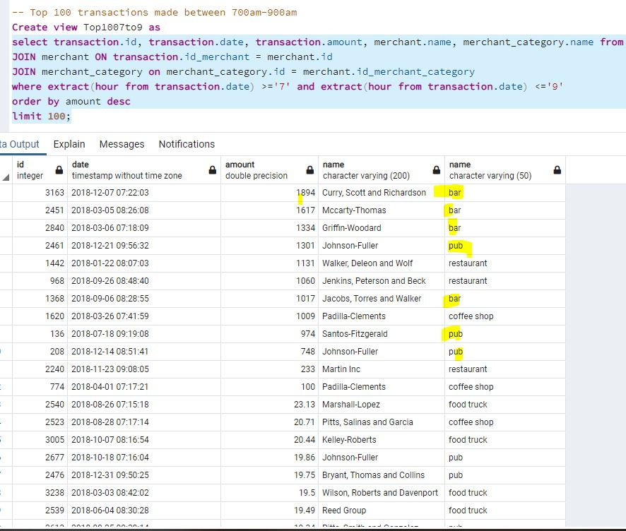
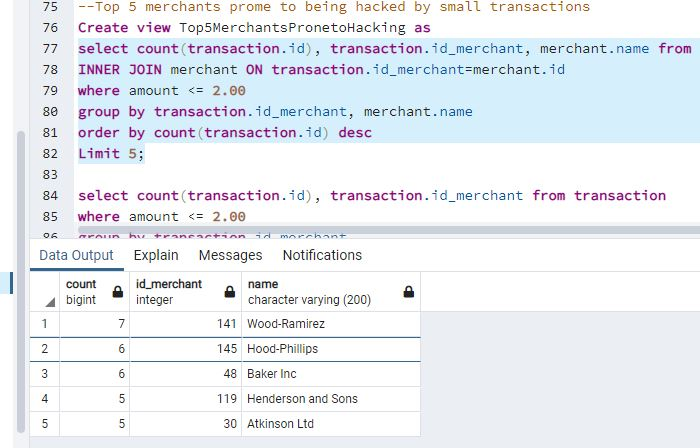
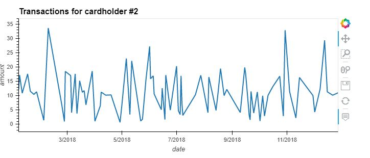
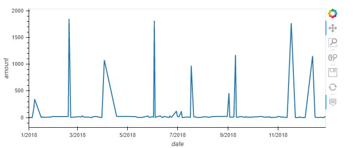
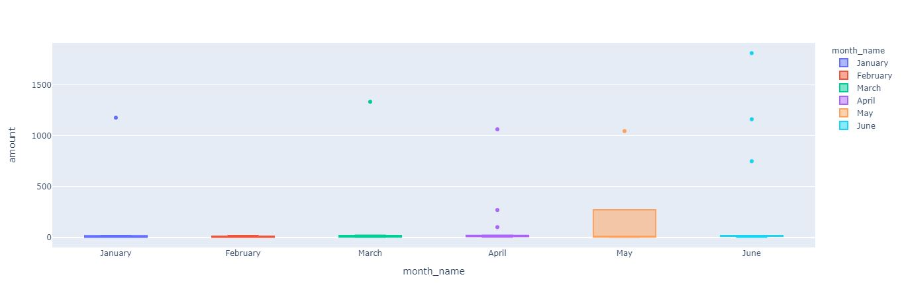

# HomeworkUnit7-SQL
### Data Analysis
#### Part 1:
Based on the analysis, the results are as follows,
  1. There are  353 transactions that have amount less than or equal to $2.00 indicating a potential hack.
  2. Based on the results above, we can conclude that there is a potential hack and the approximately 10% ( 353 out of 3500) transactions are hacked.
  3. The total sum of money where the transactions is $2.00 or less is $507.53. Even though its a small amount compared to the total amount ($142761.95), if we extrapolate this to millions of cardholders, we can imagine how much money we lose to hacking
  
 NOTE: Assuming the Pacific time zone for these transactions.  
 Invesitgating fradulent transactions by time period.
 1. Listing the top 100 transactions made between 700am-900am shows trasactions made  at bars and pubs which are usually closed at that time of the day. These clearly indicate fradulent transactions. 
 
 2. Similar to above when we query for transactions made between 200am =459am we expect all the places to be closed. So these transactions could definelty be that.
 3. The total # of transactions made between 700-900 am is 419. The hackers choose this time when the card holders are asleep and do not check their statement or alerts until later in the morning and during the day and hence delay the reporting/detection of these charges by the card holders. This gives the hackers enough time to hide any trail to avoid detection.
  THe top 5 merchants prone to hacking are
  

#### Part 2:
BY observing the chars for the transactions for card holder #2 and cardholder #18, we notice some transactions with high amounts  for cardholder #18( in the 1000s). While the transactions for a day for cardholder#2 does not exceeed $35 for a single day, we see transactions as high as $1850 (approx) for cardholder #18. THere are 7 days in the year where the transactions for cardholder #18 are close to or exceed $1000. We can confidently conclude that those are not legitimate spending by the cardholder #18.

By observing the chart for cardholder #25, we can notice anomalies almost every month.
1. In January, there is a transaction with amount of $1177
2. In March, there is a transaction with amount of $1334. 
3. In April, there is a transaction with amount of $1034. In total, there are 3 outliers in April.
4. In May, there is a transaction with amount of $1046
5. In June, there is a transactions with amount of $1813, $1162 and $749 

These are all indicative of fraudulent transactions given the high amount. In all there are 9 outliers in the first sixe months of 2018.

